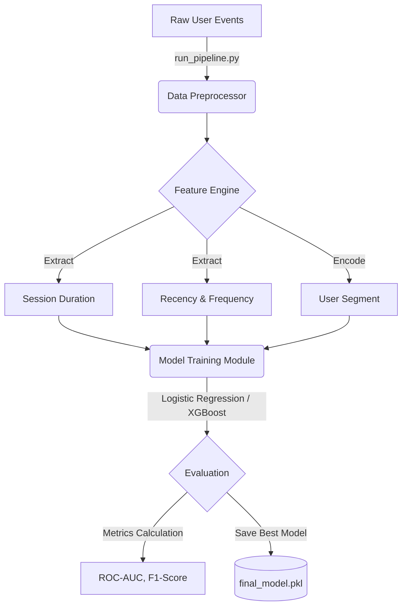
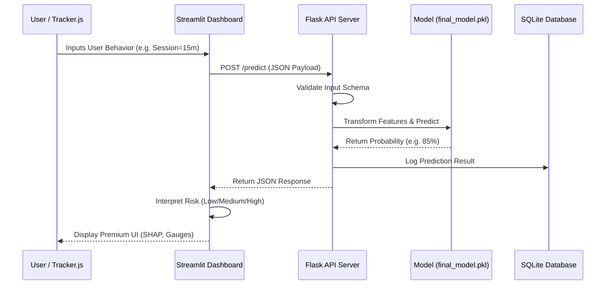
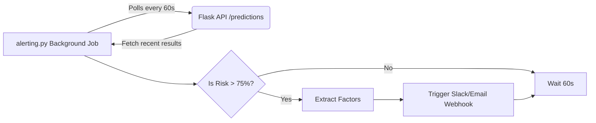

# User Drop-Off Detection: System Workflow

This document outlines how data flows through the User Drop-Off Detection system, from raw behavioral events down to real-time risk predictions in the dashboard.

## 1. End-to-End MLOps Pipeline Workflow

This workflow represents the offline process of generating data, extracting features, and training the model.

## 2. Real-Time Inference Workflow (API & Dashboard)

This workflow represents the online process when a user interacts with the Streamlit dashboard or sends a request from the web tracker.

## 3. Automated Alerting Workflow

This details how the background alerting script interacts with the API to notify the retention team of high-risk users.

